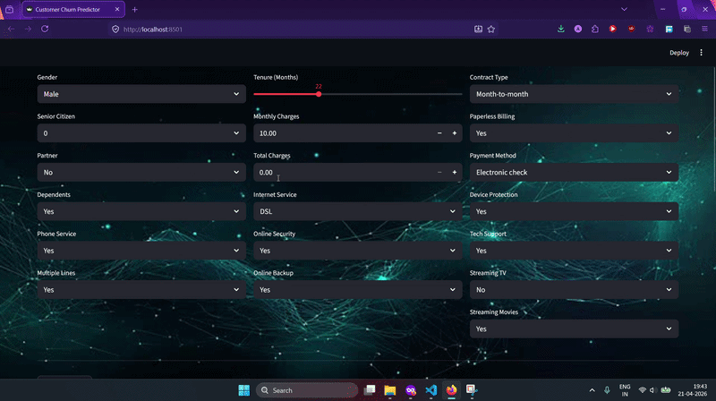

**📊 Customer Churn Predictor – Machine Learning + Streamlit**


I built this project to explore how telecom and subscription-based companies can predict and reduce customer churn using data-driven insights.
It’s a complete end-to-end solution — from preprocessing and model training to a full interactive web app.

**🎥 Demo**




**🚀 What This App Does**

The Customer Churn Predictor is a Streamlit web application that lets users input customer details and instantly get:

-> Churn prediction (Will the customer leave or stay?)

-> Confidence score in percentage

-> Clean summary of inputs

-> A polished, custom-themed UI

The goal was to create something that feels practical, realistic, and easy to understand — just like a company dashboard.

**🧠 How It Works**

The model behind the app is a Logistic Regression classifier, trained on telecom customer data.
Here’s what happens behind the scenes:

1. User enters customer details

2. Data is cleaned + encoded using the same logic used during training

3. Model predicts churn probability

4. App displays results with an intuitive visual layout

Keeping preprocessing consistent was a priority, so the app uses a saved model_columns.pkl file to ensure everything aligns exactly with the training phase.

**📂 Project Structure**

customer-churn-predictor-genai/
│
├── app/
│   ├── app.py                # Main Streamlit application
│   ├── churn_model.pkl       # Trained machine learning model
│   ├── model_columns.pkl     # Feature columns used during training
│   ├── bg.jpg                # Background image for UI
│
├── data/
│   └── Telco-Customer-Churn.csv   # Dataset used for training
│
├── notebooks/
│   └── model_training.ipynb  # Jupyter notebook for model development
│
├── demo/
│   └── demo.gif              # Demo preview of the application
│
├── requirements.txt          # Python dependencies
│
└── README.md                 # Project documentation

**⚙️ How to Run the App**
1. Clone the repo
```python
git clone https://github.com/Aditya13136/customer-churn-predictor.git
cd customer-churn-predictor-genai
```

2. Install dependencies
```python
pip install -r requirements.txt
```

3. Start the Streamlit app
```python
cd app
streamlit run app.py
```

**🛠️ Tech Stack**

-> Python

-> Streamlit

-> scikit-learn

-> pandas / numpy

-> matplotlib

-> joblib

-> VS Code

**🎯 Why I Built This**

I wanted to create a project that wasn't just “train model → print accuracy”, but something that:

>> Looks like a real application

>> Shows how ML is used in actual businesses

>> Demonstrates clean preprocessing, UI design, and model integration

>> Is portfolio-ready and recruiter-friendly

This project helped me strengthen my understanding of:

>> Feature engineering

>> One-hot encoding

>> Probabilistic model outputs

>> Streamlit UI design

>> Organizing ML projects professionally
